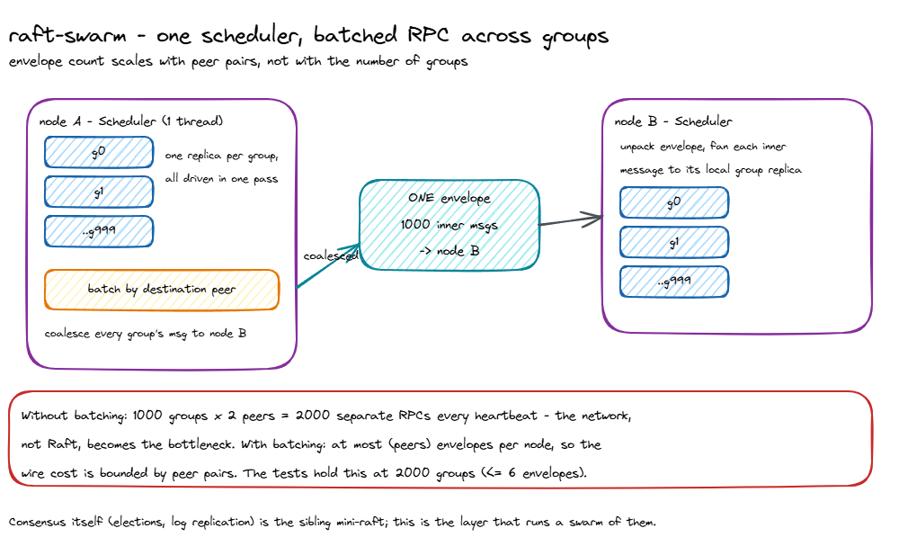

# multi-raft: design, trade-offs, and non-goals

Status: accepted
Author: Parag Sawant

Why multi-raft looks the way it does. It exists because "run Raft" and "run ten
thousand Raft groups on one box" are different engineering problems, and the
second one is where the interesting decisions live. This document is about those
decisions, and about being clear that the consensus algorithm itself is *not*
what this repo is demonstrating.

## Problem and goals

To shard a database horizontally you give each shard its own consensus group and
spread thousands of them across a few nodes. Two costs then dominate, and neither
is the Raft algorithm:

1. Run every group at **bounded per-group overhead** - specifically, no thread per
   group, because that stops scaling in the low thousands.
2. Keep **network cost proportional to peer pairs, not group count** - a hundred
   groups on node A talking to node B should not mean a hundred RPCs.
3. Stay **readable**, so the batching and scheduling can actually be reasoned
   about.

## Key design decision: the scheduler owns the groups

*(Source: [`docs/diagrams/shared-scheduler-batching.excalidraw`](docs/diagrams/shared-scheduler-batching.excalidraw) - editable in [excalidraw](https://aka.ms/excalidraw).)*

The unit of execution is a per-node `Scheduler`, not a per-group task. It holds
every group replica local to that node and drives them all in one pass. Adding a
group is inserting an entry into a dict, not spawning anything. This is the whole
reason the design scales to thousands of groups: work is proportional to groups
*processed*, with a single owner, instead of thousands of independently scheduled
threads fighting over cores.

## Key design decision: batch at the peer, not the group

Outbound messages are grouped by destination peer and coalesced into one
envelope. A group's message is just an inner item tagged with its `group` id; the
receiving scheduler unpacks the envelope and fans each item out to the right local
replica. So the number of envelopes on the wire is bounded by the number of peer
pairs, regardless of how many groups are chatting. The tests make this concrete:
at 2,000 groups across three nodes, logical messages are in the thousands but
envelope count stays at most six.

This is the single highest-leverage optimization in real multi-Raft systems, and
it's the one worth showing in a small, legible form.

## Trade-offs I made on purpose

- **Trivial leader selection stands in for real Raft.** `GroupReplica` picks the
  smallest-id member as leader instead of running elections. That's deliberate:
  the scheduling and batching layer is identical whether each group runs toy
  logic or a full election, and re-deriving Raft here would only obscure the part
  that's actually novel. Real consensus lives in the sibling `mini-raft`.
- **Synchronous, in-memory transport.** The `Cluster` pumps envelopes directly
  rather than over a socket, because the property being demonstrated - envelope
  count vs. message count - is transport-independent, and an in-memory pump keeps
  the test deterministic.
- **Metrics baked into the scheduler.** `messages_sent` / `envelopes_sent` live on
  the scheduler so the batching win is measurable in a plain assertion rather than
  inferred. A small amount of instrumentation coupling buys a lot of clarity.

## Non-goals

- **Not a reimplementation of Raft.** Elections, log replication, and the
  current-term commit rule are `mini-raft`'s job. Pairing the two is the point;
  duplicating consensus here is not.
- **No `io_uring` / zero-copy WAL.** Real multi-Raft engines persist their logs
  with `io_uring` and zero-copy tricks for throughput. That is genuinely valuable
  and genuinely OS- and hardware-specific; a pure-Python reference can't honestly
  claim those numbers, so persistence is out of scope rather than faked.
- **No dynamic membership / live rebalance yet.** Moving a group's metadata slice
  between nodes while it's serving is the natural next layer; this version fixes
  membership at group-creation time so the scheduling story stays the focus.
