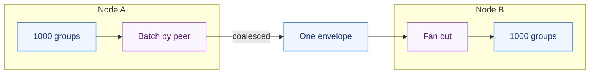

<h1 align="center">multi-raft</h1>

<p align="center">Run thousands of independent Raft consensus groups on one set of physical nodes — a shared scheduler instead of a thread per group, and cross-group RPC batching instead of an RPC per group.</p>

---

## Why this exists

A single Raft group is a solved problem (see the sibling [mini-raft](https://github.com/parag-labs/mini-raft)). Scaling a *database* horizontally means running **thousands** of them — one per shard — on a handful of machines. That's how CockroachDB, TiKV, and Spanner work. And the moment you try it, two costs dominate, neither of which is the consensus algorithm itself:

1. **A thread per group** collapses under context-switch overhead at a few thousand groups.
2. **An RPC per group** floods the network when a hundred groups on node A all need to talk to node B every heartbeat.

multi-raft is the multiplexing layer that removes both. The consensus logic is deliberately left to mini-raft; this repo is about running a *swarm* of state machines efficiently.

## What it does

- **One scheduler per physical node** drives all of that node's group replicas in a single pass — no thread-per-group.
- **Cross-group RPC batching** — every outbound message to the same peer is coalesced into one envelope, so 1,000 groups heartbeating node B send **one** envelope of 1,000 inner messages, not 1,000 RPCs.
- **Bounded wire cost** — envelope count scales with the number of *peer pairs*, not the number of groups. The tests assert this holds at 2,000 groups.

## Quickstart

```python
from multi-raft import Cluster

c = Cluster(["n1", "n2", "n3"])
for g in range(2000):
    c.add_group(f"g{g}", ["n1", "n2", "n3"])

c.run_once()

print(len(c.leaders()))        # 2000 groups, each agreed on one leader
print(c.total_messages())      # thousands of logical messages...
print(c.total_envelopes())     # ...carried by a handful of envelopes
```

## Run it

```bash
pip install -e ".[dev]"
pytest
```

## Design

- **[DESIGN.md](DESIGN.md)** — why the scheduler owns the groups (not vice versa), how batching keeps the wire cost bounded, and the honest non-goals (the consensus core is mini-raft's job; `io_uring` zero-copy WAL is a documented production-only piece, not something a pure-Python reference can claim).

## Relationship to mini-raft

`GroupReplica` here is a stand-in with trivial leader selection, on purpose — the value of this repo is the scheduling and batching layer, which is identical whether each group runs toy logic or a full mini-raft node. Swap the replica implementation and the scheduler/batcher don't change.

## How it works



## Layout

```
multi-raft/
├── raftswarm/          the multiplexing layer
│   ├── scheduler.py    the shared scheduler that runs many groups without a thread each
│   └── cluster.py      cluster wiring + cross-group RPC batching
├── tests/              convergence + the batching-win tests
├── docs/diagrams/      architecture diagrams
└── DESIGN.md           the scheduler, the batching, and the non-goals
```

## License

MIT — see [LICENSE](LICENSE).
